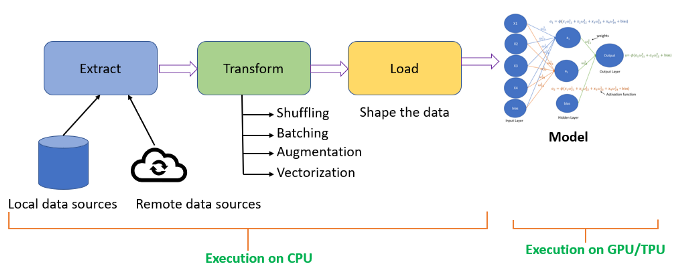
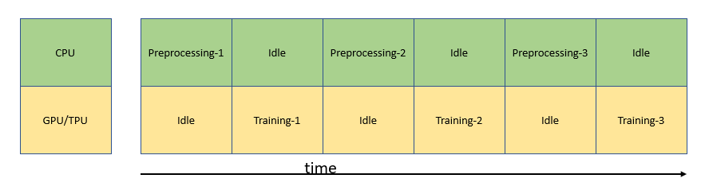

# Cómo reducir el tiempo de entrenamiento de un modelo de aprendizaje profundo utilizando tf.data

Consulta el artículo original en inglés [aquí](https://towardsdatascience.com/how-to-reduce-training-time-for-a-deep-learning-model-using-tf-data-43e1989d2961)

Aprende a crear un proceso de entrada de imágenes para eficientar el uso de los recursos del CPU y GPU para procesar
un dataset de imágenes y reducir el tiempo de entrenamiento de un modelo de aprendizaje profundo.

En este artículo aprenderás:

- Cómo son utilizados los recursos de la CPU y la GPU para el pre-procesamiento de datos y entrenamiento.
- Cómo utilizar eficientemente los recursos de la CPU y la GPU para el pre procesaiento y entrenamiento.
- Cómo utilizar tf.data para construir un pipeline de entrada eficiente.
- Cómo construir un pipeline de entrada eficiente para imágenes utilizando tf.data

## ¿Cuál es la aproximación ingenua para construir el pipeline de entrada y el entrenamiento del modelo?
Al crear un canal de entrada de datos, normalmente realizamos el proceso ETL (Extraer, Transformar y Cargar).

- Extracción, extrae los datos de diferentes fuentes de datos como fuentes de datos locales, que pueden ser de un disco duro o extraer datos de fuentes de datos remotas como el almacenamiento en la nube.
- Transformación, barajarás los datos, crearás batches, aplicarás vectorización o image augmentation.
- Cargar los datos implica limpiar los datos y transformarlos a un formato que puedan ser consumidos por un modelo de deep learning en su etapa de entrenamiento.

El pre-procesamiento de datos ocurre en el CPU, y el modelo, comúnmente, será entrenado en una GPU/TPU.

Intentando entrenar el modelo de una forma ingenua, **el CPU pre-procesa los datos para tenerlos listos, mientras la GPU/TPU se encuentra inactiva**. Cuando la GPU/TPU comienza a entrenar el modelo, el CPU se encuentra inactivo. Esto no es una forma eficiente de manejar los recursos como se muestra más abajo.

### ¿Cuáles son las opciones para agilizar el procesamiento de entrenamiento?
Para agilizar el entrenamiento, necesitamos optimizar la extracción de datos, la transformación de datos, y la carga de los datos, donde todos los anteriores suceden en el CPU.

**Extracción de datos: Optimizar la lectura desde las fuentes de datos**

**Transformación de datos: Paralelizar la aumentación de datos (data augmentation)**

**Carga de datos: Obtenga los datos un paso antes del entrenamiento**

Estas técnicas eficientarán el uso del CPU y de la GPU/TPU para el pre-procesamiento de datos y el entrenamiento.

***¿Cómo puedo lograr optimizar el flujo de entrada de datos***

### Optimizando la extracción de datos

La extracción de datos se optimiza procesando múltiples archivos de forma concurrente.
**tf.data.interleave() optimiza el proceso de extracción de datos entrelazando (interleaving) la operación de entrada y salida (I/O) para leer el archivo y el map() para aplica el pre-procesamiento de datos**

[Source:https://www.tensorflow.org/guide/data_performance#parallelizing_data_extraction]('../img/tfdata_3.png')

El número de superposición es especificado por el argumento **cycle_length**, mientras que el nivel de paralelismo es establecido por el argumento **num_parallel_calls**.

**num_parallel_calls genera múltiples hilos para utilizar múltiples núcleos en el proceso de extracción de datos en paralelo utilizando múltiples CPUs**

***¿Cómo saber cuántos CPUs o núcleos utilizar***

Puedes encontrar el número de núcleos que tiene tu CPU y especificar ese número, pero una mejor opción es delegar ese nivel de paralelismo a tf.data utilizando **tf.data.experimental.AUTOTUNE**

- AUTOTUNE hará que tf.data establezca dinámicamente el valor (de la cantidad de núcleos) en tiempo de ejecución.
- tf.data encontrará que tanta carga generar sobre el CPU para todas las operaciones que permitan este ajuste.
- AUTOTUNE decidirá sobre el nivel de paralelismo para el tamaño del buffer, los recursos del CPU, y también para las operaciones de entrada y salida (I/O).

### Transformando datos en paralelo

Image augmentation, parte del pre-procesamiento, ocurre en la CPU. Cada augmentation, normalización, cambio de escala de una imagen, es una operación costosa y puede ralentizar el proceso de entrenamiento.

***Que pasaría si mandamos a llamar todas esas operaciones sobre las imagénes utilizando todos los núcleos con el procesamiento en paralelo.***

**tf.data.map() puede recibir una función definida por el usuario conteniendo todas las image augmentations que se quieran aplicar al dataset**

**tf.data.map() tiene un parámetro num_parallel_calls para aprecer múltiples hilos para utilizar múltiples núcleos en la computadora, para hacer que el proceso de utilizar múltiples CPU sea en paralelo**

### Almacenando los datos en caché

**El método cache() permite almacenar la información en un archivo en específico o en memoria**

- Cuando almacenamos los datos en memoria, la primera vez que los datos son iterados, serán almacenados para que, en posteriores iteraciones, sean leídos desde esa misma locación en memoria.
- Cuando almacenamos los datos en un archivo, incluso la primera iteración sobre los datos será leída desde el archivo.
- Almacenar en caché produce los mismos elementos en cada iteración, utiliza shuffle() para seleccionar los elementos de forma aleatoria en las iteraciones después de almacenar los datos en caché.

### Obtenga previamente los datos superponiendo el procesamiento y el entrenamiento.

**La función prefetching en tf.data sobrepone el pre-procesamiento de datos y el entrenamiento del modelo. El pre-procesamiento de datos corre un paso delante del entrenamiento**, como se muestra más abajo, lo cual reduce el tiempo total de entrenamiento del modelo.

Imagen

El número de elementos para la captación previa de datos debería ser igual o mayor que el tamaño de la muestra utilizada para un solo paso del entrenamiento. Podemos utilizar AUTOTUNE para solicitar a tf.data que asigne dinámicamente el valor del tamaño del búfer en tiempo de ejecución.

**Todas las operaciones: map, prefetch, interleave, batch, repeat, shuffle, y almacenar el caché son parte de tf.data lo que permite que puedas construir**

# Descarga de datos
En este punto ese necesario que sepas que existe una Kaggle API (¡yo tampoco lo podía creer!), gracias a ella podemos
obtener datasets de Kaggle sin mayor esfuerzo, incluyendo el dataset para este ejercicio.
- [Instrucciones para instalar la API y crear tu credenciales](https://github.com/Kaggle/kaggle-api)
- Descarga al dataset con el siguiente comando: `kaggle competitions download -c dogs-vs-cats`
